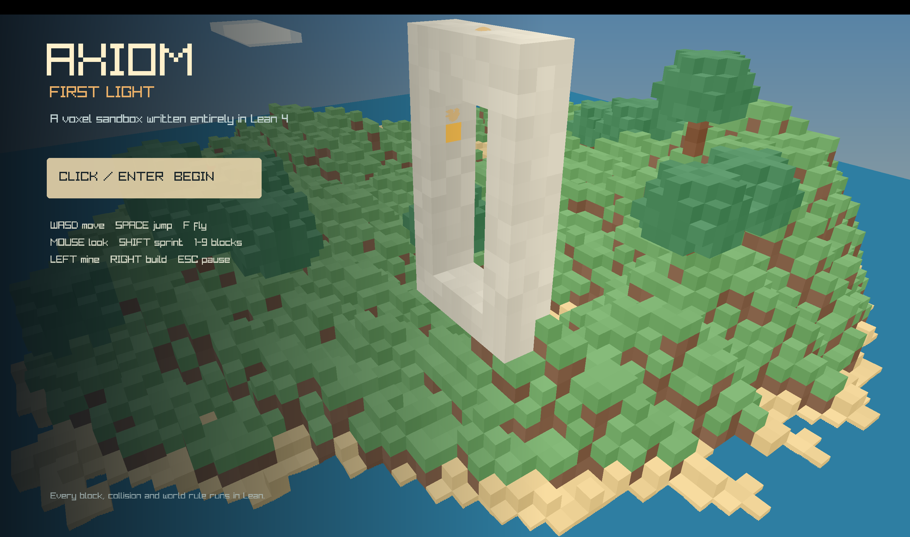
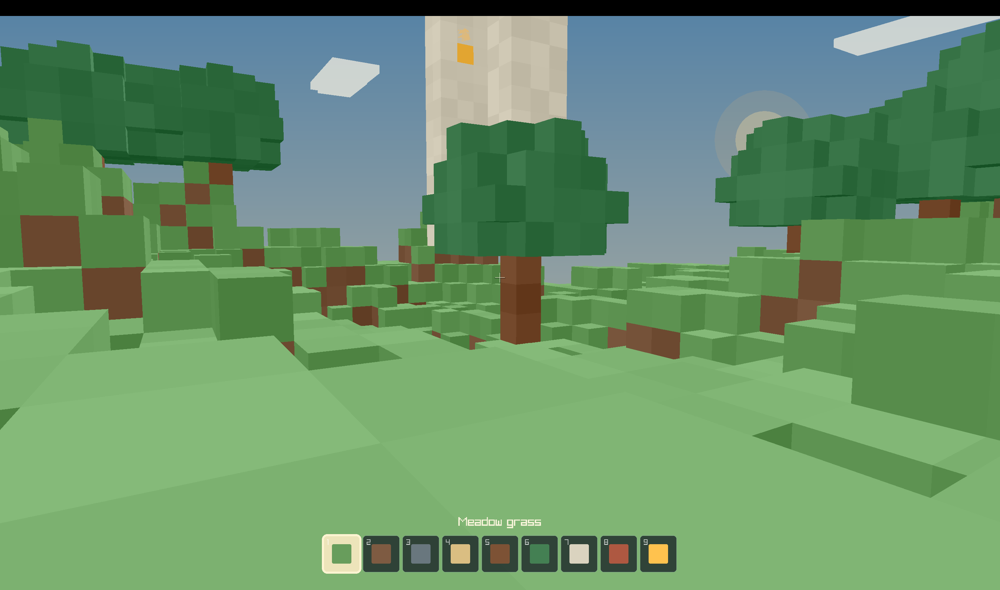

# Axiom: First Light

**A first-person voxel game built in Lean 4.**

[](https://lean-lang.org/)
[](LICENSE)
[](#run-it)

You might know Lean as a language for proving mathematical theorems. Axiom uses
the same machinery to build a game.

The result is a small native voxel sandbox. Explore an island, walk or fly,
mine and place blocks, find its cave and marble sun gate, and return later to
the world you changed.





## What makes it a Lean game?

The world generation, voxel storage, meshing, physics, ray casting, editing,
particles, procedural audio, saves, UI, and real-time game loop are written in
Lean 4.

[Raylib](https://www.raylib.com/) is the platform layer: it opens the window,
reads input, plays audio, and sends Lean's meshes to the GPU. In other words,
Lean owns the game; Raylib connects it to the computer.

This is a complete playable game, not a browser demo or a small Lean model
wrapped around an engine written in another language.

## What is in the world?

- A finite 96 × 96 × 48 island with beaches, forest, caves, ocean, clouds,
  stars, and a day/night cycle
- Walking, sprinting, jumping, and creative flight
- Mining and building with nine materials
- Block picking, debris, synthesized sound effects, and persistent saves
- A hidden cave and marble sun gate to discover

First Light is intentionally compact: there is no crafting, combat,
multiplayer, or infinite terrain.

## Run it

### Downloaded release

On an Apple Silicon Mac, unzip the release and open `Axiom.app`. Because the app
is ad-hoc signed rather than Apple-notarized, you may need to right-click it and
choose **Open** the first time.

### From source (macOS)

You need Apple Silicon macOS 26, Homebrew
[`elan`](https://github.com/leanprover/elan), and `/usr/bin/clang`.

```bash
brew install elan
```

Clone this repository, enter its directory, then run:

```bash
./scripts/setup.sh
./scripts/build.sh
./scripts/run.sh
```

The first setup builds the pinned Raylib source, including Axiom's small macOS
Retina resize fix, and can take several minutes.
Afterwards, `./scripts/run.sh` launches the game.

### From source (Windows)

You need elan, MSYS2 with the UCRT64 toolchain, CMake, Ninja, and Git for
Windows. From git-bash:

```bash
./scripts/check-windows.sh
./scripts/setup-windows.sh
./scripts/run-windows.sh
```

See [`docs/WINDOWS.md`](docs/WINDOWS.md) for the full guide, configuration,
and troubleshooting. Saves live at `%APPDATA%\Axiom\first-light.axm`.

## Explore the code

| File | Responsibility |
|---|---|
| [`Main.lean`](Main.lean) | Game loop, input, and screens |
| [`Axiom/World.lean`](Axiom/World.lean) | Voxels, terrain, cave, and landmark |
| [`Axiom/Physics.lean`](Axiom/Physics.lean) | Movement, collision, and targeting |
| [`Axiom/Mesh.lean`](Axiom/Mesh.lean) | Voxel faces and GPU-ready geometry |
| [`Axiom/Render.lean`](Axiom/Render.lean) | World presentation, sky, HUD, and menus |
| [`Axiom/Save.lean`](Axiom/Save.lean) | Validated, versioned saves |
| [`Axiom/Audio.lean`](Axiom/Audio.lean) | Procedural sound generation |
| [`Tests.lean`](Tests.lean) | Deterministic acceptance tests |

For the full frame pipeline, see
[`docs/ARCHITECTURE.md`](docs/ARCHITECTURE.md).

## Test and package

```bash
# Run the acceptance suite
LEAN_CC=/usr/bin/clang lake build axiom_tests
LEAN_CC=/usr/bin/clang lake exe axiom_tests

# Build the macOS app
./scripts/package.sh
codesign --verify --deep --strict dist/Axiom.app

# Create a release ZIP and checksum
./scripts/release.sh
```

Saves live at `~/Library/Application Support/Axiom/first-light.axm`. Invalid
saves are moved aside rather than overwritten.

## Contributing and license

Contributions are welcome; see [`CONTRIBUTING.md`](.github/CONTRIBUTING.md) and the
[`roadmap`](docs/ROADMAP.md). Report security issues using
[`SECURITY.md`](.github/SECURITY.md).

Axiom is released under the [MIT License](LICENSE). Third-party licenses are
listed in [`THIRD_PARTY_NOTICES.md`](docs/THIRD_PARTY_NOTICES.md). No third-party art
or audio assets are included.
